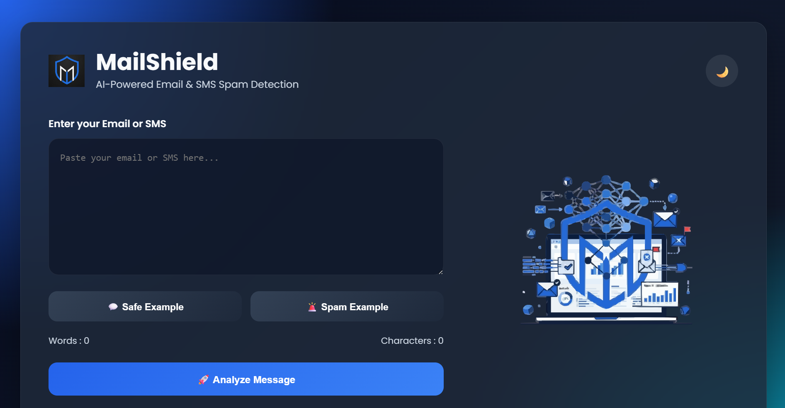
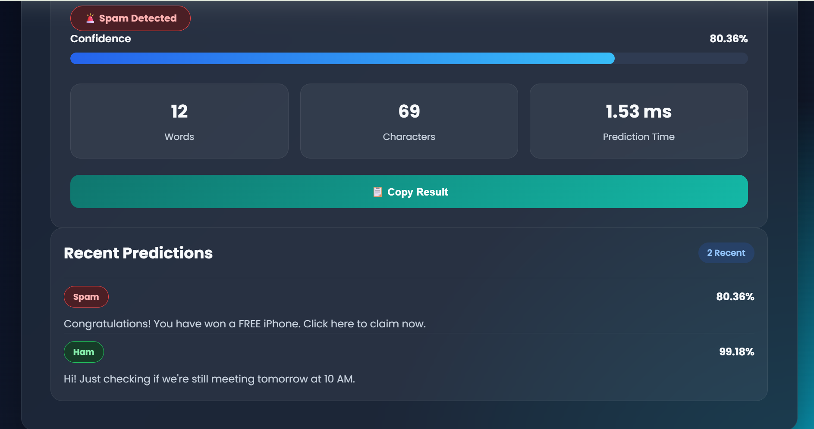
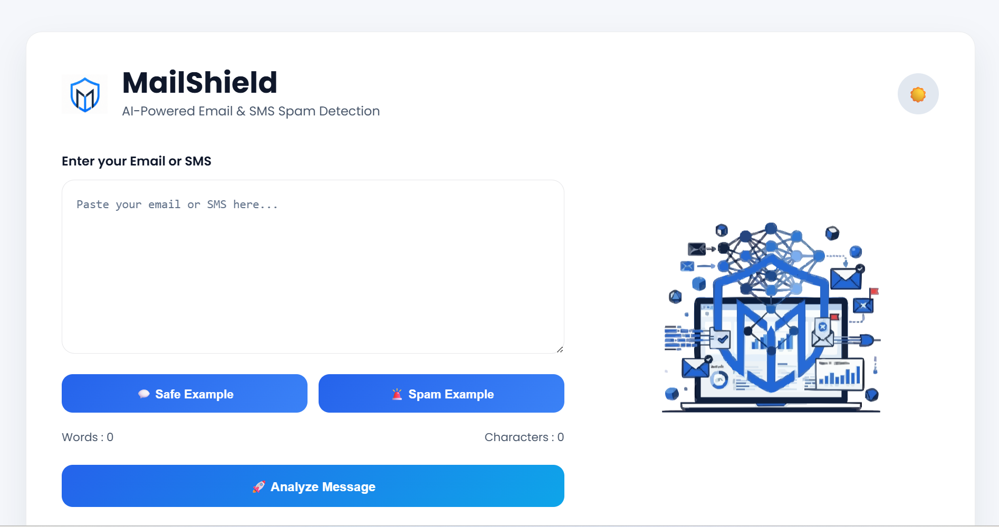
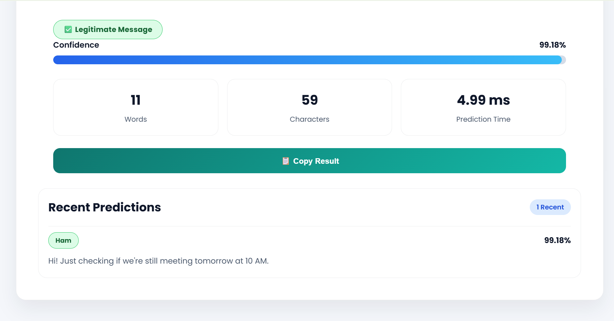
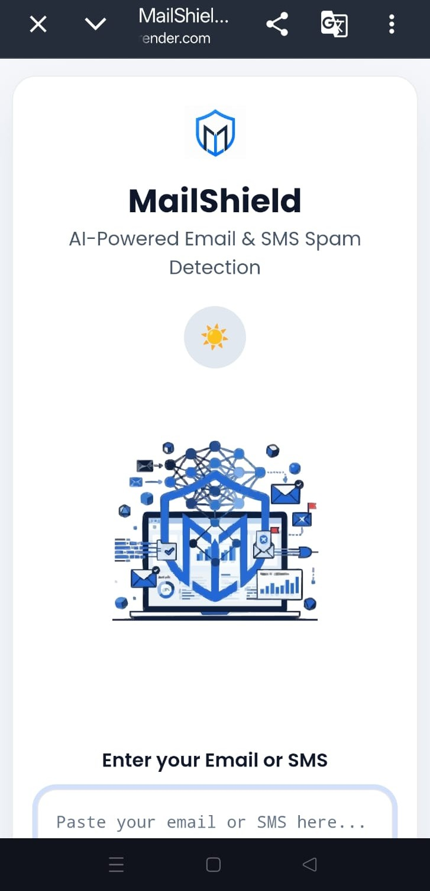
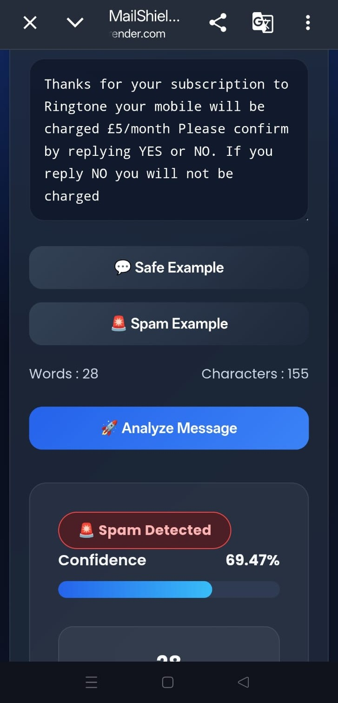
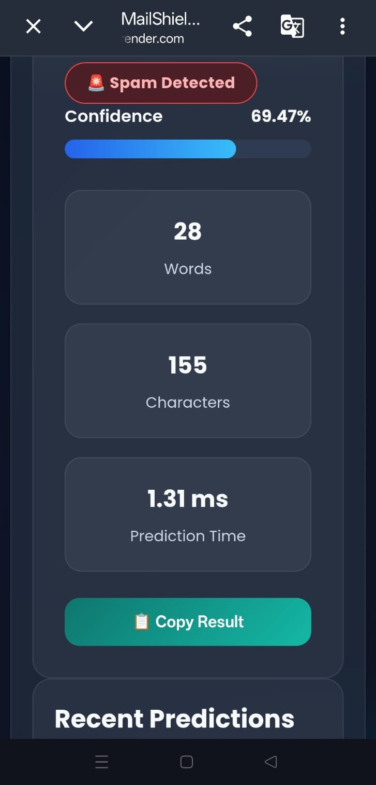

# MailShield - AI Email & SMS Spam Classifier


> An AI-powered web application that classifies Email and SMS messages as **Spam** or **Ham (Safe)** using Natural Language Processing (NLP) and Machine Learning.

---

## 🌐 Live Demo

🚀 **Try MailShield:**  
**https://mailshield-qu2v.onrender.com/**

---

## 📌 Features

- ✉️ Email & SMS Spam Detection
- 🤖 Machine Learning Classification
- 🧹 NLP Text Preprocessing
- 🌙 Dark & ☀️ Light Theme
- 📊 Confidence Score Visualization
- 📈 Prediction Statistics
- 📋 Copy Prediction Result
- 💬 Safe & Spam Sample Messages
- 📜 Prediction History
- 📱 Fully Responsive UI
- ⚡ Fast Flask Backend

---

## 🖼️ Screenshots

### 🌙 Dark Mode
<p float="left">
  
  
</p>

---

### ☀️ Light Mode
<p float="left">
  
  
</p>

---

### 📱 Mobile Views
<p float="left">
  
  
  
</p>

## 🧠 Machine Learning Pipeline

```text
Input Message
      │
      ▼
Text Preprocessing
      │
      ▼
TF-IDF Vectorization
      │
      ▼
Multinomial Naive Bayes
      │
      ▼
Spam / Ham Prediction
```

---

## 🛠️ Tech Stack

### Frontend

- HTML5
- CSS3
- JavaScript

### Backend

- Flask
- Python

### Machine Learning

- Scikit-Learn
- Pandas
- NumPy
- NLTK
- Joblib

---

## 📂 Project Structure

```text
Email Spam Classifier/
│
├── app/
│   └── app.py
│
├── data/
│
├── models/
│   ├── spam_model.pkl
│   └── vectorizer.pkl
│
├── src/
│   ├── preprocess.py
│   ├── train.py
│   ├── predict.py
│   └── evaluate.py
│
├── static/
│   ├── css/
│   ├── js/
│   ├── images/
│   └── icons/
│
├── templates/
│   ├── index.html
│   └── 404.html
│
├── requirements.txt
├── README.md
├── Procfile
├── runtime.txt
├── render.yaml
└── .gitignore
```

---

## ⚙️ Installation

Clone the repository:

```bash
git clone https://github.com/YOUR_USERNAME/email_spam_classifier.git
```

Go to the project folder:

```bash
cd email_spam_classifier
```

Create a virtual environment:

```bash
python -m venv venv
```

Activate the virtual environment

### Windows

```bash
venv\Scripts\activate
```

### Linux / macOS

```bash
source venv/bin/activate
```

Install dependencies:

```bash
pip install -r requirements.txt
```

Run the application:

```bash
python app/app.py
```

Open your browser:

```
http://127.0.0.1:5000
```

---

## 📊 Model Information

| Property | Value |
|----------|-------|
| Algorithm | Multinomial Naive Bayes |
| Feature Extraction | TF-IDF Vectorizer |
| NLP | Tokenization, Stopword Removal, Stemming |
| Language | Python |

---

## 🚀 Future Improvements

- User Authentication
- Email Inbox Integration
- REST API
- Deep Learning Models
- Multi-language Spam Detection
- Cloud Database Support
- Dashboard Analytics

---

## 📜 License

This project is licensed under the MIT License.

---

## 👨‍💻 Author

**Inzila Danish Khan**

GitHub: https://github.com/Inzila2130

---

Thank you for visiting this project. Feedback and suggestions are always appreciated.